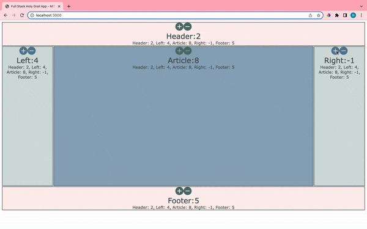
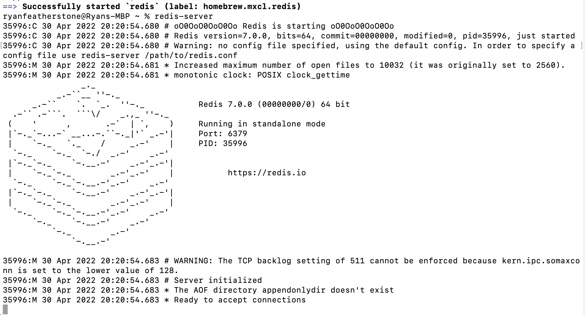

  # Full-Stack Holy Grail Application 🎨 

[Holy grail](https://en.wikipedia.org/wiki/Holy_grail_(web_design)), full stack [Node.js](https://nodejs.org/en/) application with a Redis database. </p>
<p>
  The holy grail is a web page layout which has multiple, equal height columns that are defined with style sheets.
</p>

 

<ul>
  <li>Begin with frontend. </li>
  <li>Create a client that could update all of the panels in a reactive manner, using react framework. </li>
  <li>Use superagent to make calls to the backend running on Node.js with the additional package, Express for all of the web tasks and the defining of the routes and the API. </li>
  <li>Add an additional package to be able to communicate with Redis, the database that we are running on top of Docker. </li>
</ul>
<hr/>

## Tasks
* Use the Redis client to initialise values for header, left, article, right, and footer. These values should be
  ``` 
  "header", 0, "left", 0, "article", 0, "right", 0, "footer", 0 
  ```
* Implement the data() method to use Promises to get the values, using the Redis client.
* Implement the /update/:key/:value endpoint by using the Redis client to update a given key-value pair by first locating the records matching the provided key, then updating it to the new provided value. 


## Download and Installation

* Install Redis by the running ```npm install redis``` in your local directory.
 
* To install dependencies for the Node application, run ``` npm install ``` 
* To start running your application on http://localhost:3000, run ``` node index.js ```
* To test your Redis installation, run ```redis-server```
* Once Redis is running, you can test it by running  ```redis-cli ``` 

## Learn More
To learn about Redis, check out the [redis documentation](https://redis.io/documentation) and [installation](https://redis.io/download).

## License
This project is licensed under the MIT License
